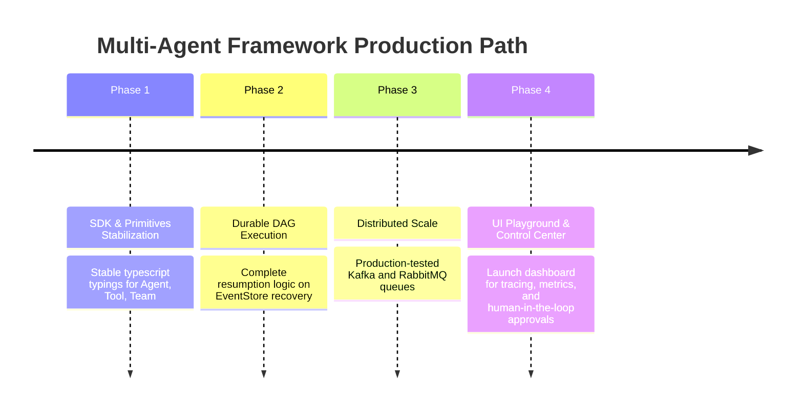

# Multi-Agent Framework Architecture & Implementation Plan

This implementation plan outlines the architecture, SDK design, memory engine, workflow capabilities, event systems, security layers, and distributed deployment blueprints for the production-grade multi-agent framework implemented under `confused-ai`.

---

## Complete Architecture

The framework is structured as a modular, layered system designed to run as a lightweight library that scales up to a distributed, fault-tolerant orchestrator.

```
                  ┌────────────────────────────────────────────────────────┐
                  │                      Developer API                     │
                  │  (import { Agent, Team, Workflow } from 'confused-ai') │
                  └───────────────────────────┬────────────────────────────┘
                                              │
                  ┌───────────────────────────▼────────────────────────────┐
                  │                    Agentic Core                        │
                  │   AgenticRunner (ReAct loop: Think -> Act -> Observe)  │
                  │     ├── LLM Providers (OpenAI, Anthropic, Gemini, etc.) │
                  │     ├── Tool & Skill Registries (Type-safe schemas)    │
                  │     ├── Session & Memory (Episodic, Semantic, Vector)  │
                  │     └── Mastermind (Automatic Session Compaction)      │
                  └───────────────────────────┬────────────────────────────┘
                                              │
                  ┌───────────────────────────▼────────────────────────────┐
                  │                 Orchestration & Workflows              │
                  │     ├── Team Coordination (Consensus, Swarm, Supervisor)│
                  │     ├── Graph Engine (DAGs, Branching, Parallelism)    │
                  │     └── Durable Executor (State checkpoints)           │
                  └───────────────────────────┬────────────────────────────┘
                                              │
                  ┌───────────────────────────▼────────────────────────────┐
                  │               Distributed Protocols & Bus              │
                  │     ├── A2A Protocol (Agent-to-Agent spec)             │
                  │     ├── Model Context Protocol (MCP client/server)     │
                  │     └── BackgroundQueues (Kafka, BullMQ, RabbitMQ)     │
                  └───────────────────────────┬────────────────────────────┘
                                              │
                  ┌───────────────────────────▼────────────────────────────┐
                  │               Production Safety & Observability        │
                  │     ├── Guardrails (Input/Output validation, PII caps) │
                  │     ├── Circuit Breaker, Budget Caps, HITL Hooks       │
                  │     └── OpenTelemetry & Metric Registries              │
                  └────────────────────────────────────────────────────────┘
```

### Component Architecture Details

1. **Agentic Core**: Runs the inner ReAct loop. Monitors token count and invokes the context compaction pipelines (`Mastermind`) when thresholds are crossed.
2. **Workflows & DAGs**: Manages graph topology. Supports parallel execution via a worker pool, event-sourced state propagation, and persistence adapters for pausing/resuming runs.
3. **Protocols (A2A & MCP)**: Exposes endpoints for agent capability advertisements, task routing, and secure payload transport. Standardizes tool discovery via Model Context Protocol.
4. **Reliability & Event Bus**: Buffers events and queues execution using Kafka or BullMQ. Circuit breakers prevent downstream LLM exhaustion.

---

## Folder Structure

The framework is configured as a clean monorepo hierarchy to ensure clean modular boundaries and independent packages:

```
agent-framework/
├── src/
│   ├── core/                  # Core AgenticRunner, LLM provider registry, ReAct loop
│   ├── contracts/             # Core TypeScript interface declarations (dependency-free)
│   ├── agent.ts               # Fluent SDK wrapper (Agent class)
│   ├── create-agent.ts        # Pure functional agent factory
│   ├── orchestration/         # Teams, Swarm, Supervisors, Consensus, and A2A Protocol
│   │   ├── a2a/               # Google Agent-to-Agent protocol implementation (HTTP server/client)
│   │   ├── multi-agent/       # Swarm, Team, Supervisor implementations
│   │   └── core/              # Shared orchestrator primitives
│   ├── graph/                 # DAG execution engine, GraphBuilder, DurableExecutor
│   ├── memory/                # Multi-layer storage (Short-term, Vector long-term, Episodic)
│   ├── compression/           # Sliding window, token counting, Mastermind semantic compaction
│   │   └── mastermind/        # Intelligent CCR (Code & Context Reduction) crushers
│   ├── guard/                 # Circuit breakers, budget enforcers, rate limiters
│   ├── guardrails/            # Input/output validation, PII redaction, prompt injection defense
│   ├── serve/                 # HTTP routing, SSE streams, Admin API, Auth middleware
│   ├── background/            # Queue wrappers (Kafka, BullMQ, RabbitMQ, SQS)
│   ├── tools/                 # 100+ integrations (mcp, shell, search, db, social, productivity)
│   └── observe/               # OpenTelemetry trace/metric provider setup
├── templates/                 # Production-grade deployment manifests
│   ├── Dockerfile             # Multistage build script
│   ├── k8s.yaml               # Kubernetes Deployments, Services, and Horizontal Pod Autoscalers
│   ├── docker-compose.yml     # Local orchestration (App + Redis + Kafka + Postgres)
│   └── grafana-dashboard.json # Grafana monitoring JSON export
└── docs/                      # Extensive markdown documentation
```

---

## SDK Design

The SDK is designed to be fluent, type-safe, and intuitive. It supports both a quick functional setup and a fully configurable builder.

```ts
import { agent, tool } from 'confused-ai';
import { z } from 'zod';

// Define a type-safe tool
const calculator = tool({
  name: 'calculator',
  description: 'Add or multiply numbers',
  parameters: z.object({
    op: z.enum(['add', 'multiply']),
    a: z.number(),
    b: z.number()
  }),
  execute: async ({ op, a, b }) => op === 'add' ? a + b : a * b
});

// Fluent builder pattern
const researcher = new Agent({
  instructions: 'You are a math researcher. Use your tools to perform calculations.'
})
  .model('gpt-4o')
  .tool(calculator)
  .budget({ maxUsdPerUserPerDay: 0.10 })
  .memory(new VectorStoreMemory());

const result = await researcher.run('What is 432 * 987?');
console.log(result.text);
```

---

## Runtime Engine

The runtime runs an optimized **ReAct (Reason-Act-Observation)** loop:

```ts
export class AgenticRunner {
  async step(context: AgentContext): Promise<StepResult> {
    // 1. Perform Security Scans & Injection Checks
    await this.guardrails.validateInput(context.lastMessage);

    // 2. Format Context and apply Mastermind Compaction if nearing budget
    const activeContext = await this.mastermind.align(context);

    // 3. Request LLM completion
    const response = await this.llm.generate(activeContext);

    // 4. Inspect for Tool Calls or Final Text
    if (response.toolCalls) {
      const toolResults = await this.toolRegistry.execute(response.toolCalls);
      return { status: 'continue', updates: toolResults };
    }

    return { status: 'complete', text: response.text };
  }
}
```

---

## Memory Engine

The Memory system utilizes a **four-layer architecture** to store and retrieve data:

```
┌──────────────────────────────────────────────────────────────────────────┐
│                          Memory Core Interface                           │
└─────┬───────────────────┬───────────────────────┬───────────────────┬────┘
      │                   │                       │                   │
┌─────▼─────┐       ┌─────▼─────┐           ┌─────▼─────┐       ┌─────▼─────┐
│  Layer 1  │       │  Layer 2  │           │  Layer 3  │       │  Layer 4  │
│Short-term │       │ Long-term │           │ Episodic  │       │ Semantic  │
│  Context  │       │  Vector   │           │Workflows  │       │  Graph    │
└───────────┘       └───────────┘           └───────────┘       └───────────┘
```

1. **Short-Term Memory**: Conversation memory managed via rolling token-counters. Obsolete blocks are pruned dynamically.
2. **Long-Term Memory**: Embedded semantic vectors. Matches queries using cosine similarity (supports Pinecone, Redis, Chroma, SQLite).
3. **Episodic Memory**: Serialized workflow histories containing decisions, paths taken, and outcomes. Enables replay and behavioral pattern learning.
4. **Semantic Memory**: Knowledge stores mapped as graphs (entities and relations). Tracks organizational facts.

---

## Workflow Engine

The graph workflow engine allows developers to build complex DAG (Directed Acyclic Graph) models:

```ts
import { createGraph, DAGEngine } from 'confused-ai/workflow';

const pipeline = createGraph('order-processing')
  .task('validate', async (ctx) => checkOrder(ctx.input))
  .router('check-fraud', (ctx) => ctx.state.validate.isSuspicious ? 'escalate' : 'charge')
  .task('charge', async (ctx) => chargeCreditCard(ctx.input.amount))
  .wait('escalate', { event: 'fraud-override', timeoutMs: 3600 * 1000 })
  .task('fulfill', async (ctx) => shipGoods(ctx.input))
  .edge('validate', 'check-fraud')
  .edge('check-fraud', 'charge')
  .edge('check-fraud', 'escalate')
  .edge('charge', 'fulfill')
  .edge('escalate', 'fulfill')
  .build();

const engine = new DAGEngine(pipeline, {
  eventStore: new SqliteEventStore({ path: 'checkpoints.db' })
});

const result = await engine.run({ orderId: '9845' });
```

---

## MCP Integration

Full Model Context Protocol (MCP) support allows seamless integration between agent clients and remote tool servers:

* **MCP Client**: Auto-discovers and imports schemas from any MCP URL. Exposes remote tools as native SDK tools.
* **MCP Server**: Easily wraps local tools to run on standard JSON-RPC Stdio/HTTP (SSE) transports, enabling integration with environments like Claude Desktop.

---

## A2A Integration

Implements Google's Agent-to-Agent protocol spec. Exposes agents over HTTP/SSE endpoints, supporting agent capability registries, negotiation, and cross-framework message delegation.

```ts
import { A2AServer, createHttpA2AClient } from 'confused-ai/workflow';

// Server Exposing Agent A
const a2aServer = new A2AServer({ agent: agentA, port: 4000 });
await a2aServer.start();

// Client Representing Agent B
const caller = createHttpA2AClient({ url: 'http://localhost:4000/a2a' });
const delegateResult = await caller.run({ prompt: 'Generate financial report' });
```

---

## Event System

Built as an event-driven architecture. Emits structured state-change records that are dispatched to in-memory, Redis, or Kafka backends.

```ts
import { KafkaBackgroundQueue } from 'confused-ai/background';

const queue = new KafkaBackgroundQueue({
  brokers: ['kafka-cluster:9092'],
  topic: 'agent-events'
});

// Broadcast state transitions
queue.publish('AgentStarted', { agentId: 'researcher', runId: '123' });
queue.publish('ToolExecuted', { toolName: 'search', status: 'success' });
```

---

## Example Application

### Complex Swarm: Multi-Agent Software Development

```ts
import { Team, createAgent } from 'confused-ai';
import { githubTool } from 'confused-ai/tools/devtools';

const coder = createAgent({
  name: 'Coder',
  instructions: 'Write clean TypeScript code meeting specifications.',
  tools: [githubTool]
});

const critic = createAgent({
  name: 'Critic',
  instructions: 'Review code submissions for bugs and style issues.',
});

const team = new Team({
  name: 'DevSwarm',
  members: [coder, critic],
  coordinator: 'swarm'
});

await team.run('Refactor the database connector to support connection pooling');
```

---

## Deployment Architecture

For high scalability and resilience, the framework utilizes stateless compute pods combined with distributed databases and event streaming:

* **State Store**: PostgreSQL or SQLite for audit logs and event store checkpoints.
* **Cache & Memory**: Redis cluster for session state caching, rates, and locks.
* **Queue Bus**: Kafka cluster for scaling async task worker pools.
* **Tracing & Telemetry**: OTLP metrics pushing to Prometheus and OpenTelemetry collectors (Jaeger/Grafana).

```
                      Load Balancer
                            │
               ┌────────────┴────────────┐
               ▼                         ▼
         [Agent Pod 1]             [Agent Pod 2]
         (Stateless)               (Stateless)
               │                         │
      ┌────────┴──────────┬──────────────┴────────┐
      ▼                   ▼                       ▼
 [Redis Cluster]   [Kafka Broker]          [Postgres DB]
 (Session Locks)   (Event Streams)         (Audit Trails)
```

---

## Kubernetes Manifests

Provides declarative configuration under `templates/k8s.yaml` to deploy scaling agent workers:

```yaml
apiVersion: apps/v1
kind: Deployment
metadata:
  name: confused-ai-agent-worker
  labels:
    app: agent-worker
spec:
  replicas: 3
  selector:
    matchLabels:
      app: agent-worker
  template:
    metadata:
      labels:
        app: agent-worker
    spec:
      containers:
      - name: worker
        image: confused-ai/agent-worker:latest
        ports:
        - containerPort: 8787
        env:
        - name: OPENAI_API_KEY
          valueFrom:
            secretKeyRef:
              name: openai-secret
              key: api-key
        - name: REDIS_URL
          value: "redis://redis-service:6379"
        - name: KAFKA_BROKERS
          value: "kafka-service:9092"
        readinessProbe:
          httpGet:
            path: /health/readiness
            port: 8787
          initialDelaySeconds: 5
          periodSeconds: 10
        livenessProbe:
          httpGet:
            path: /health/liveness
            port: 8787
          initialDelaySeconds: 15
          periodSeconds: 20
---
apiVersion: autoscaling/v2
kind: HorizontalPodAutoscaler
metadata:
  name: agent-worker-hpa
spec:
  scaleTargetRef:
    apiVersion: apps/v1
    kind: Deployment
    name: confused-ai-agent-worker
  minReplicas: 2
  maxReplicas: 10
  metrics:
  - type: Resource
    resource:
      name: cpu
      target:
        type: Utilization
        averageUtilization: 75
```

---

## Production Roadmap



---

## Verification Plan

### Automated Tests
* Run unit and integration tests using Bun or Vitest to verify all components (memory layers, workflows, routing strategies):
  ```bash
  bun test
  ```
* Run typechecking to confirm compile-time safety:
  ```bash
  bun run typecheck
  ```

### Manual Verification
* Deploy a test agent using the docker-compose template to verify Redis/Kafka connections.
* Verify Prometheus metric endpoints (`/metrics`) and SSE stream responses locally.
